# 🎵 TgMusicBot – Telegram Music Bot [](https://github.com/depinrise/TgMusicBotFork/stargazers)

**A high-performance Telegram Voice Chat Bot** for streaming music from YouTube, Spotify, JioSaavn, and more. Built with Python, Py-Tgcalls, and PyTdBot.

<p align="center">
  <!-- GitHub Stars -->
  <a href="https://github.com/depinrise/TgMusicBotFork/stargazers">
          
  </a>
  
  <!-- GitHub Forks -->
  <a href="https://github.com/depinrise/TgMusicBotFork/network/members">
          
  </a>

  <!-- Last Commit -->
  <a href="https://github.com/depinrise/TgMusicBotFork/commits/main">
          
  </a>

  <!-- Repo Size -->
  <a href="https://github.com/depinrise/TgMusicBotFork">
          
  </a>

  <!-- Language -->
  <a href="https://www.python.org/">
    
  </a>

  <!-- License -->
  <a href="https://github.com/depinrise/TgMusicBotFork/blob/main/LICENSE">
          
  </a>

  <!-- Open Issues -->
  <a href="https://github.com/depinrise/TgMusicBotFork/issues">
          
  </a>

  <!-- Pull Requests -->
  <a href="https://github.com/depinrise/TgMusicBotFork/pulls">
          
  </a>

  <!-- GitHub Workflow CI -->
  <a href="https://github.com/depinrise/TgMusicBotFork/actions">
          
  </a>
</p>

<p align="center">
   
</p>

### 🔥 Live Bot: [@FallenBeatzBot](https://t.me/FallenBeatzBot)

---

## ✨ Key Features

| Feature                       | Description                                         |
|-------------------------------|-----------------------------------------------------|
| **🎧 Multi-Platform Support** | YouTube, Spotify, Apple Music, SoundCloud, JioSaavn |
| **📜 Playlist Management**    | Queue system with auto-play                         |
| **🎛️ Advanced Controls**     | Volume, loop, seek, skip, pause/resume              |
| **🌐 Multi-Language**         | English, Hindi, Spanish, Arabic support             |
| **⚡ Low Latency**             | Optimized with PyTgCalls                            |
| **🐳 Docker Ready**           | One-click deployment                                |
| **🔒 Anti-Ban**               | Cookie & API-based authentication                   |

---

## 🏗️ Architecture

```mermaid
graph TB
    %% User Layer
    User[👤 Telegram User]
    Group[👥 Telegram Group]
    
    %% Main Bot Layer
    Bot[🤖 TgMusic Bot]
    PyTdBot[📱 PyTdBot Client]
    PyTgCalls[🎵 PyTgCalls]
    
    %% Service Layer
    Downloader[⬇️ Download Service]
    Player[🎮 Player Service]
    Jobs[⏰ Job Scheduler]
    
    %% Cache & Memory
    ChatCache[💾 Chat Cache]
    UserCache[👤 User Cache]
    BotCache[🤖 Bot Cache]
    
    %% Database Layer
    MongoDB[(🟢 MongoDB<br/>Persistent Storage)]
    
    %% External APIs
    YouTube[📺 YouTube API]
    Spotify[🎧 Spotify API]
    JioSaavn[🎵 JioSaavn API]
    AppleMusic[🍎 Apple Music API]
    SoundCloud[☁️ SoundCloud API]
    
    %% Auto-Leave System
    ActivityTracker[📊 Activity Tracker]
    AutoLeave[🚪 Auto-Leave System]
    
    %% Configuration
    Config[⚙️ Environment Config]
    
    %% Main Flow
    User -.->|Commands| Bot
    Group -.->|Messages| Bot
    Bot -->|Voice Chat| PyTgCalls
    Bot -->|Client Management| PyTdBot
    
    %% Service Flow
    Bot -->|Download Requests| Downloader
    Bot -->|Playback Control| Player
    Bot -->|Scheduled Tasks| Jobs
    
    %% Cache Flow
    Bot -->|Store Data| ChatCache
    Bot -->|Store Data| UserCache
    Bot -->|Store Data| BotCache
    
    %% Database Flow
    Bot -->|Persist Data| MongoDB
    ChatCache -->|Sync| MongoDB
    UserCache -->|Sync| MongoDB
    
    %% Download Flow
    Downloader -->|Video/Audio| YouTube
    Downloader -->|Music| Spotify
    Downloader -->|Music| JioSaavn
    Downloader -->|Music| AppleMusic
    Downloader -->|Music| SoundCloud
    
    %% Auto-Leave Flow
    Bot -->|Track Activity| ActivityTracker
    ActivityTracker -->|Inactive Chats| AutoLeave
    AutoLeave -->|Leave Groups| Bot
    
    %% Configuration Flow
    Config -->|Settings| Bot
    Config -->|API Keys| Downloader
    Config -->|DB Config| MongoDB
    Config -->|Auto-Leave| AutoLeave
    
    %% Styling
    classDef userStyle fill:#E3F2FD,stroke:#1976D2,stroke-width:3px,color:#000
    classDef botStyle fill:#F3E5F5,stroke:#7B1FA2,stroke-width:3px,color:#000
    classDef serviceStyle fill:#FFF8E1,stroke:#F57C00,stroke-width:3px,color:#000
    classDef cacheStyle fill:#E8F5E8,stroke:#388E3C,stroke-width:3px,color:#000
    classDef databaseStyle fill:#FCE4EC,stroke:#C2185B,stroke-width:3px,color:#000
    classDef apiStyle fill:#FFF3E0,stroke:#FF9800,stroke-width:3px,color:#000
    classDef configStyle fill:#E0F2F1,stroke:#00695C,stroke-width:3px,color:#000
    
    class User,Group userStyle
    class Bot,PyTdBot,PyTgCalls botStyle
    class Downloader,Player,Jobs,ActivityTracker,AutoLeave serviceStyle
    class ChatCache,UserCache,BotCache cacheStyle
    class MongoDB databaseStyle
    class YouTube,Spotify,JioSaavn,AppleMusic,SoundCloud apiStyle
    class Config configStyle
```



## Auto-Leave Feature

The bot includes an intelligent auto-leave system that:

- **1-Week Timer**: Automatically leaves groups that have been inactive for 1 week
- **Activity Detection**: Stays in groups that have recent activity
- **Smart Monitoring**: Checks for activity every 6 hours
- **Activity Tracking**: Records activity when users interact with the bot

### Activity Tracking

The bot tracks activity in the following scenarios:
- Any message sent in the group
- Bot commands used (`/play`, `/skip`, `/pause`, etc.)
- Callback button interactions
- Bot configuration changes

### Commands

- `/activity` - Show chat activity statistics (developers only)
- `/test_autoleave` - Test auto-leave functionality (developers only)

## 🚀 Quick Deploy

[](https://heroku.com/deploy?template=https://github.com/depinrise/TgMusicBotFork)

---

## 📦 Installation Methods


<details>

<summary><strong>📌 Docker Installation (Recommended) (Click to expand)</strong></summary>

### 🐳 Prerequisites
1. Install Docker:
   - [Linux](https://docs.docker.com/engine/install/)
   - [Windows/Mac](https://docs.docker.com/desktop/install/)

### 🚀 Quick Setup
1. Clone the repository:
   ```sh
   git clone https://github.com/depinrise/TgMusicBotFork.git && cd TgMusicBotFork
   ```

### 🔧 Configuration
1. Prepare environment file:
   ```sh
   cp sample.env .env
   ```

2. Edit configuration (choose one method):
   - **Beginner-friendly (nano)**:
     ```sh
     nano .env
     ```
     - Edit values
     - Save: `Ctrl+O` → Enter → `Ctrl+X`

   - **Advanced (vim)**:
     ```sh
     vi .env
     ```
     - Press `i` to edit
     - Save: `Esc` → `:wq` → Enter

### 🏗️ Build & Run
1. Build Docker image:
   ```sh
   docker build -t tgmusicbot .
   ```

2. Run container (auto-restarts on crash/reboot):
   ```sh
   docker run -d --name tgmusicbot --env-file .env --restart unless-stopped tgmusicbot
   ```

### 🔍 Monitoring
1. Check logs:
   ```sh
   docker logs -f tgmusicbot
   ```
   (Exit with `Ctrl+C`)

### ⚙️ Management Commands
- **Stop container**:
  ```sh
  docker stop tgmusicbot
  ```

- **Start container**:
  ```sh
  docker start tgmusicbot
  ```

- **Update the bot**:
  ```sh
  docker stop tgmusicbot
  docker rm tgmusicbot
  git pull origin master
  docker build -t tgmusicbot .
  docker run -d --name tgmusicbot --env-file .env --restart unless-stopped tgmusicbot
  ```

</details>


<details>
<summary><strong>📌 Step-by-Step Installation Guide (Click to Expand)</strong></summary>

### 🛠️ System Preparation
1. **Update your system** (Recommended):
   ```sh
   sudo apt-get update && sudo apt-get upgrade -y
   ```

2. **Install essential tools**:
   ```sh
   sudo apt-get install git python3-pip ffmpeg tmux -y
   ```

### ⚡ Quick Setup
1. **Install UV package manager**:
   ```sh
   pip3 install uv
   ```

2. **Clone the repository**:
   ```sh
   git clone https://github.com/depinrise/TgMusicBotFork.git && cd TgMusicBotFork
   ```

### 🐍 Python Environment
1. **Create virtual environment**:
   ```sh
   uv venv
   ```

2. **Activate environment**:
   - Linux/Mac: `source .venv/bin/activate`
   - Windows (PowerShell): `.\.venv\Scripts\activate`

3. **Install dependencies**:
   ```sh
   uv pip install -e .
   ```

### 🔐 Configuration
1. **Setup environment file**:
   ```sh
   cp sample.env .env
   ```

2. **Edit configuration** (Choose one method):
   - **For beginners** (nano editor):
     ```sh
     nano .env
     ```
     - Edit values
     - Save: `Ctrl+O` → Enter → `Ctrl+X`

   - **For advanced users** (vim):
     ```sh
     vi .env
     ```
     - Press `i` to edit
     - Save: `Esc` → `:wq` → Enter

### 🤖 Running the Bot
1. **Start in tmux session** (keeps running after logout):
   ```sh
   tmux new -s musicbot
   tgmusic
   ```

   **Tmux Cheatsheet**:
   - Detach: `Ctrl+B` then `D`
   - Reattach: `tmux attach -t musicbot`
   - Kill session: `tmux kill-session -t musicbot`

### 🔄 After Updates
To restart the bot:
```sh
tmux attach -t musicbot
# Kill with Ctrl+C
tgmusic
```

</details>

---

## ⚙️ Configuration Guide

<details>
<summary><b>🔑 Required Variables (Click to expand)</b></summary>

| Variable     | Description                         | How to Get                                                               |
|--------------|-------------------------------------|--------------------------------------------------------------------------|
| `API_ID`     | Telegram App ID                     | [my.telegram.org](https://my.telegram.org/apps)                          |
| `API_HASH`   | Telegram App Hash                   | [my.telegram.org](https://my.telegram.org/apps)                          |
| `TOKEN`      | Bot Token                           | [@BotFather](https://t.me/BotFather)                                     |
| `STRING1-10` | Pyrogram Sessions (Only 1 Required) | [@StringFatherBot](https://t.me/StringFatherBot)                         |
| `MONGO_URI`  | MongoDB Connection                  | [MongoDB Atlas](https://cloud.mongodb.com)                               |
| `OWNER_ID`   | User ID of the bot owner            | [@GuardxRobot](https://t.me/GuardxRobot) and type `/id`                  |
| `LOGGER_ID`  | Group ID of the bot logger          | Add [@GuardxRobot](https://t.me/GuardxRobot) to the group and type `/id` |

#### Optional Variables
| Variable           | Description                                                       | How to Get                                                                                                                                                              |
|--------------------|-------------------------------------------------------------------|-------------------------------------------------------------------------------------------------------------------------------------------------------------------------|
| `API_URL`          | API URL                                                           | Start [@FallenApiBot](https://t.me/FallenApiBot)                                                                                                                        |
| `API_KEY`          | API Key                                                           | Start [@FallenApiBot](https://t.me/FallenApiBot) and type `/apikey`                                                                                                     |
| `MIN_MEMBER_COUNT` | Minimum number of members required to use the bot                 | Default: 50                                                                                                                                                             |
| `PROXY`            | Proxy URL for the bot if you want to use it for yt-dlp (Optional) | Any online service                                                                                                                                                      |
| `COOKIES_URL`      | Cookies URL for the bot                                           | [](https://github.com/depinrise/TgMusicBotFork/blob/main/TgMusic/cookies/README.md) |
| `DEFAULT_SERVICE`  | Default search platform (Options: youtube, spotify, jiosaavn)     | Default: youtube                                                                                                                                                        |
| `SUPPORT_GROUP`    | Telegram Group Link                                               | Default: https://t.me/+zFIaHmyIfwMzZjBl                                                                                                                                     |
| `SUPPORT_CHANNEL`  | Telegram Channel Link                                             | Default: https://t.me/FallenProjects                                                                                                                                    |
| `AUTO_LEAVE`       | Leave all chats for all userbot clients                           | Default: True                                                                                                                                                           |
| `START_IMG`        | Start Image URL                                                   | Default: [IMG](https://i.pinimg.com/1200x/e8/89/d3/e889d394e0afddfb0eb1df0ab663df95.jpg)                                                                                |                                                      |
| `DEVS`             | User ID of the bot owner                                          | [@GuardxRobot](https://t.me/GuardxRobot) and type `/id`: e.g. `5938660179, 5956803759`                                                                                  |

</details>

---

## 🍪 Avoiding Bans

### Option 1: Premium API
```env
API_URL=https://tgmusic.fallenapi.fun
API_KEY=your-secret-key
```
📌 Get keys: [Contact @AshokShau](https://t.me/AshokShau) or [@FallenApiBot](https://t.me/FallenApiBot)

### Option 2: Cookies
[](https://github.com/depinrise/TgMusicBotFork/blob/main/TgMusic/cookies/README.md)

---

## 🤖 Bot Commands

| Command              | Description                         |
|----------------------|-------------------------------------|
| `/play [query]`      | Play music from supported platforms |
| `/skip`              | Skip current track                  |
| `/pause` / `/resume` | Control playback                    |
| `/volume [1-200]`    | Adjust volume                       |
| `/queue`             | Show upcoming tracks                |
| `/loop`              | Enable/disable loop                 |

---

## 🤝 Contributing

1. Fork the repository
2. Create a feature branch (`git checkout -b feature/AmazingFeature`)
3. Commit changes (`git commit -m 'Add some AmazingFeature'`)
4. Push to branch (`git push origin feature/AmazingFeature`)
5. Open a Pull Request

**Note:** Minor typo fixes will be closed. Focus on meaningful contributions.

---

## 📜 License

  
**TgMusicBotFork** is licensed under the [GNU Affero General Public License v3 or later](https://www.gnu.org/licenses/agpl-3.0.html).

Original work by [AshokShau](https://github.com/AshokShau)  
Forked and maintained by [depinrise](https://github.com/depinrise)

## 💖 Support

Help keep this project alive!  
[](https://t.me/+zFIaHmyIfwMzZjBl)  
[](https://t.me/AshokShau)

---

## 🔗 Connect

[](https://github.com/AshokShau)  
[](https://t.me/FallenProjects)

---
